# Enabling Experimentation Workshop

This workshop will give you a hands on experience with enabling quick experimentation using ephemeral
environments in a pull request workflow. There are multiple ways to achieve this but in this workshop
we will use a declarative method that involves ArgoCD, Kubernetes, GitHub and vcluster.

## Requirements

You will only require:
- a working GitHub account
- a browser and internet access.

# Part 0: Repository access

In order to get started you will need to be added as a contributor to this repository. This will
allow you to create branches and pull requests.

1. In your browser navigate to https://github.com/rio/enabling-experimentation-workshop
1. Click the star button.
   
    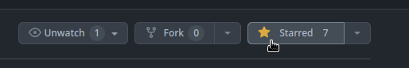

1. Refresh the page once in a while until you see a notification that someone invited you as a contributor.

    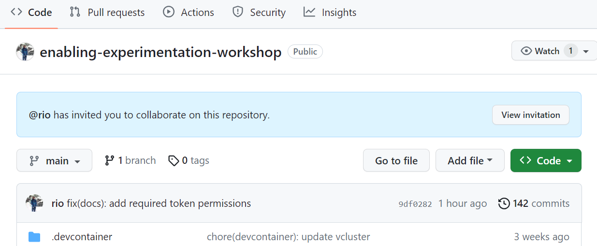

1. Accept the invitation.

    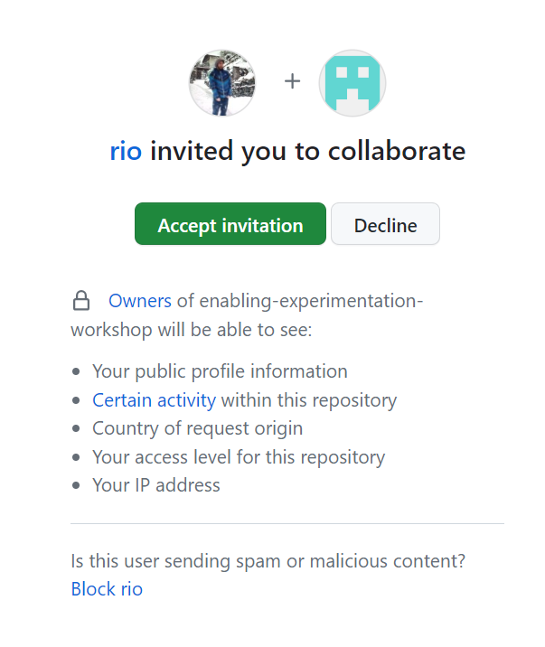

1. You should now have commit access to the repository. You can create and delete branches but you
   cannot touch the main branch.

    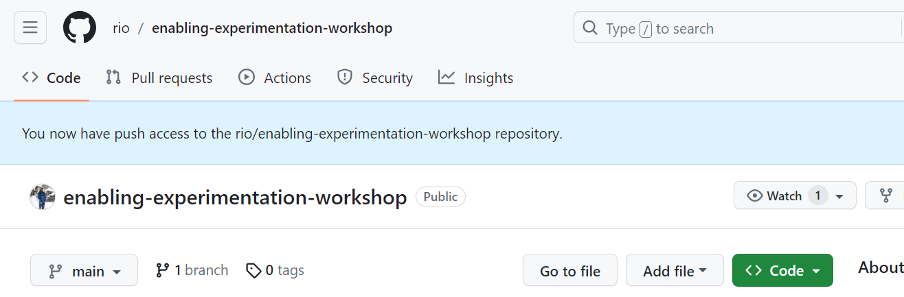

# Part 1: A pull request

We'll start by making a simple change. We'll change the version of the podinfo image that is used.
This will just be the standard GitHub pull request workflow you'd be used to.

1. In the browser open the file `podinfo/preview/kustomization.yaml`.

    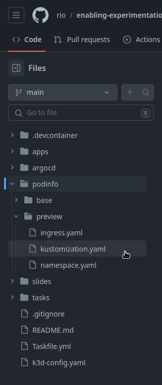

1. Click the `Edit this file` button.

    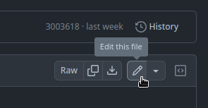

1. Change the `newTag` to `6.4.0`.

    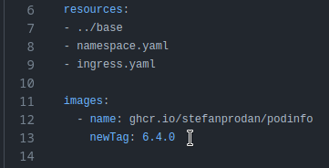

1. Commit the changes by clicking the `Commit changes` button.

    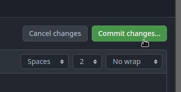

1. Commit it to a new branch by clicking the `Create a new branch for this commit and start a pull request` button. Name your branch the same as your username. This will make it easier to find later. Confirm by clicking `Propose changes`.

    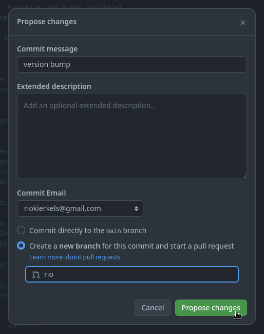

1. In the `Open a pull request` page click `Create pull request`.

    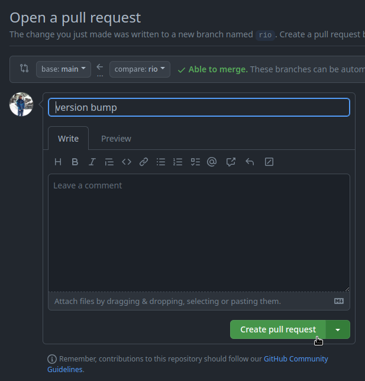

# Part 2: The cuttlefish

Now that you've created the pull request the magic will happen. The pull request will trigger a new
environment to be created for you separate from all other environments but including the version change.
This is an asynchronous process so it will take a couple of minutes to complete. In a normal setup
other CI processes could (and should!) also run, like linting, builds or tests.

1. Wait for the orange `Some checks haven't completed yet` message to appear.

    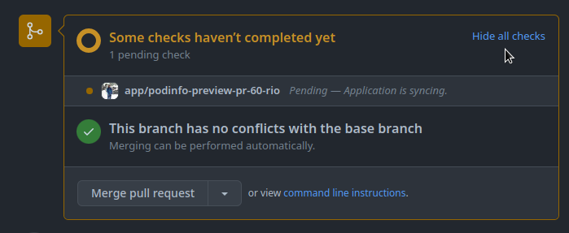

1. Once the green `All checks have passed` block appears, click the `Show all checks` button next to it.

    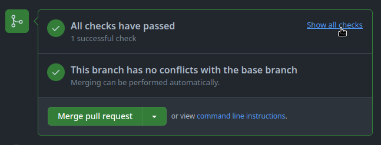

1. Click the `Details` link next to the `app/...` check. Make sure you open this in a different tab and keep it open.

    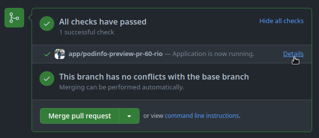

1. Watch the cuttlefish clap. Note the version of the podinfo image.

    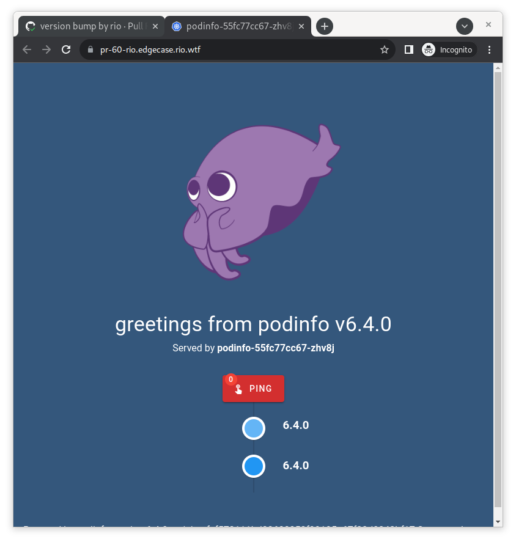

# Part 3: The updates

To emulate some more experimental changes we'll make a couple more changes to the podinfo deployment.
These are just updates to the image versions and configuration. But these changes could be actual
application code changes or even completely new infrastructure applications like using a different
database.

## Image version update

Let's start with another image version update.

1. Navigate back to your branch by clicking on your branch name near the pull request title.

    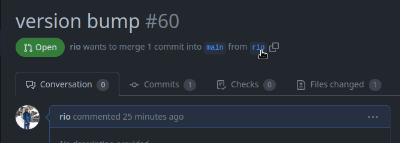

1. Open the `podinfo/preview/kustomization.yaml` file and update the tag again. This time to `6.4.1`.

    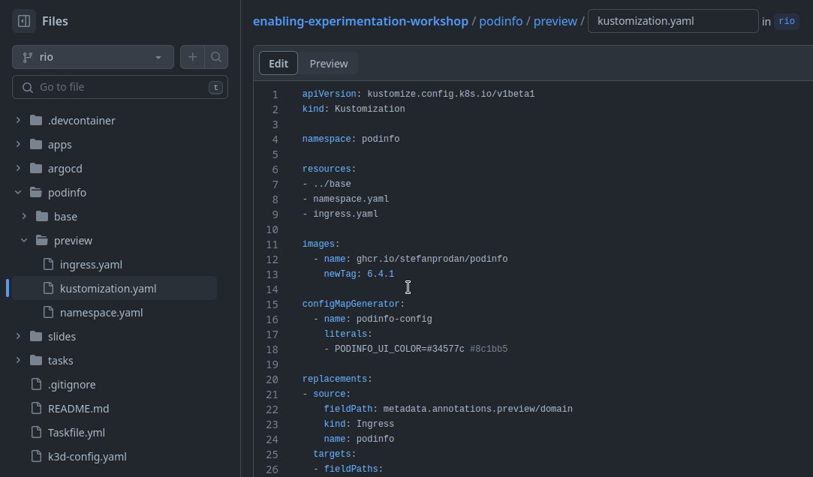

1. Commit it again using the `Commit changes` button and this time use the `Commit directly to the ... branch` option to commit directly to your branch.

    

1. Watch the cuttlefish again. After a while the version number will update to `6.4.1`.

    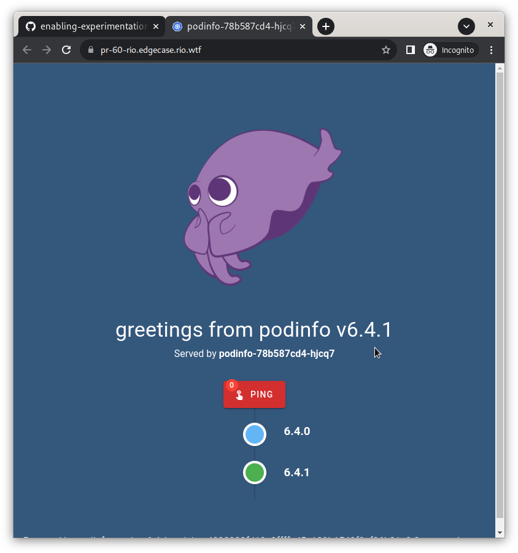

## A splash of color

Now that we've updated the image version we'll make a small configuration change. We'll change the
background color.

1. One final time lets go back to that `podinfo/preview/kustomization.yaml` file and this we'll
  edit the `PODINFO_UI_COLOR` configmap value. You can use your own hexadecimal color or use the one
  in the comment next to the original value.

    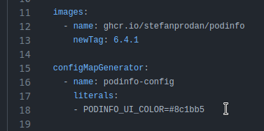

1. Commit it and watch the cuttlefish again. After a while the background should start to change.

    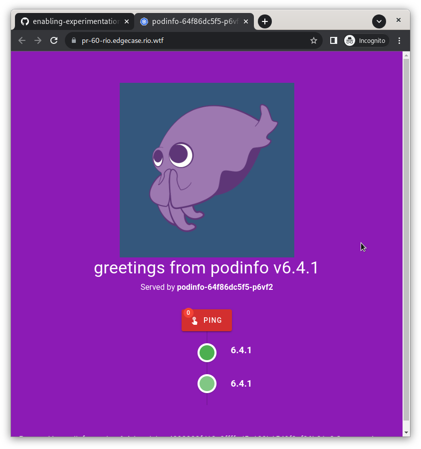

# Part 4: The environment

All of these changes are nice but what is this environment that is being created? Let's take a look.

## Accessing the environment

Each of your ephemeral environments will be accessible through a code-server instance. This is a web
based version of VS Code that is running in your environment accessible through a URL.

1. Open up a new tab with your podinfo page and edit the URL adding `code-` in front of it.

    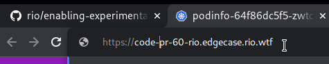

1. You will be prompted for a password. For your convenience it is set to be the same as your
   branch name. Simply click the copy button next to your branch name on the pull request page.

    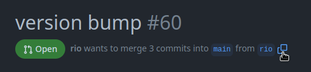
    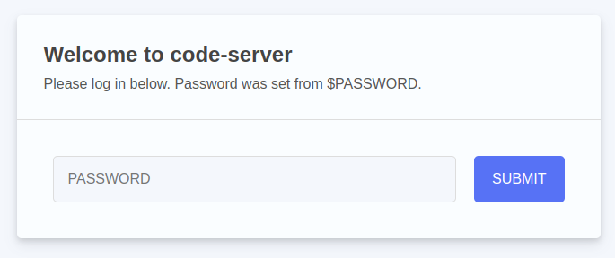

1. Click the `Yes I trust the authors button.`

    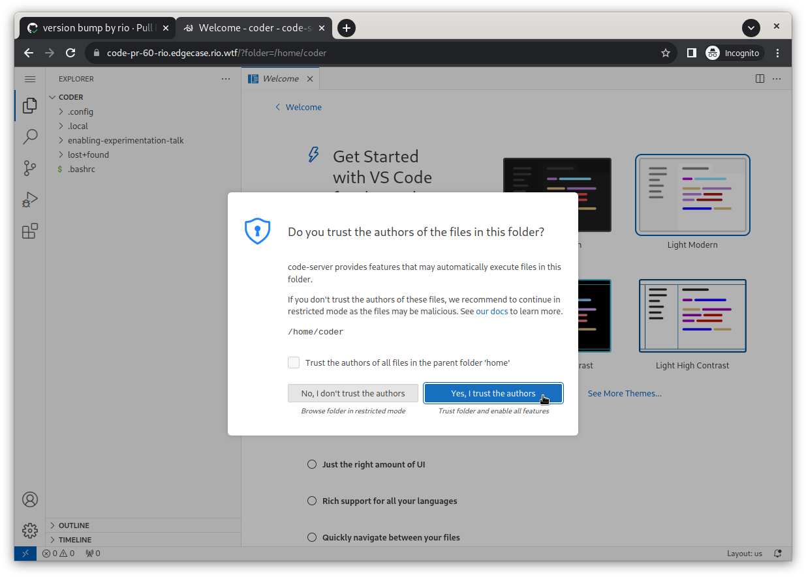

1. Optionally change the color theme to something you like by clicking on the `Browse Color Themes`
   button. Or by clicking on the cog wheel in the bottom left corner then navigate to `Themes -> Color Theme`

    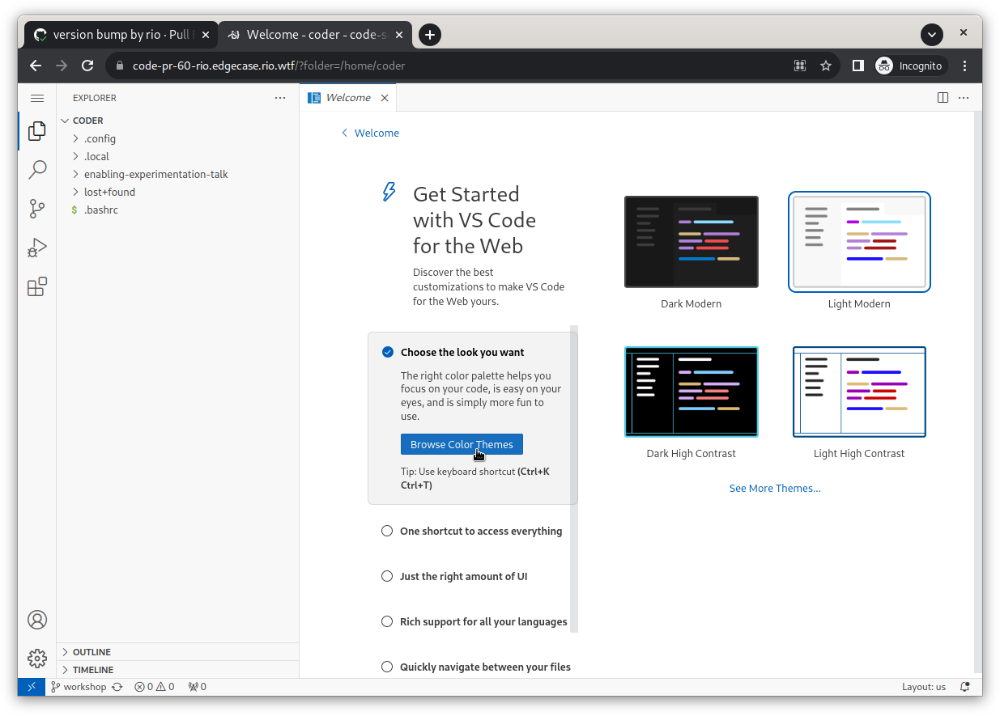
    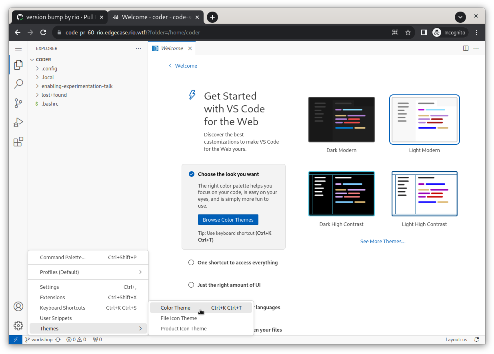

1. If you look on the left hand side you'll see the contents of the `/home/coder` folder. To make
   the next steps easier the enabling experimentation repo is already cloned into your environment.

   Let's open this up by navigating to the menu in the top left (the three horizontal bars) and
   going to `File -> Open Folder`.

    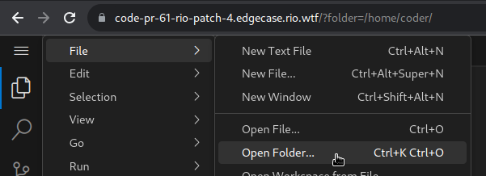

  Enter `/home/code/enabling-experimentation-talk` in the input field that pops up and click `Ok`.
  Your browser will reload.

   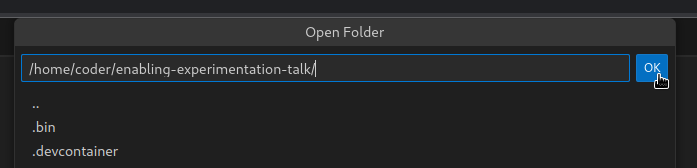

## Taking a look around

Now that you're in your very own environment lets take a look around by running some commands.

1. Open a new terminal by going to the menu again and selecting `Terminal -> New Terminal`.

    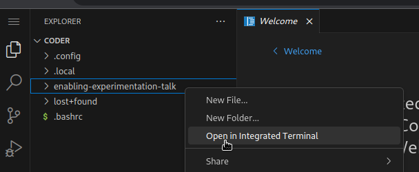

  > Note you can make the terminal bigger by closing the file explorer (click the little file icon in the top left)
  > and maximizing the terminal (click the `^` icon next to the `x` on the top right part of the terminal).

1. Checkout your new environment by running kubectl.

    ```bash
    kubectl get pods,svc,ingress -A
    ```

    It should show you something similar to this. Notice that there are not many workloads deployed.
    Just the coredns pod, our podinfo deployment and the code-server pod in which you're running these commands.
    
    ```bash
    NAMESPACE     NAME                               READY   STATUS    RESTARTS   AGE
    kube-system   pod/coredns-864d4658cb-nq9nb       1/1     Running   0          40m
    code-server   pod/code-server-68b7db57fc-jkrpf   1/1     Running   0          39m
    podinfo       pod/podinfo-64f86dc5f5-p6vf2       1/1     Running   0          18m
    podinfo       pod/podinfo-64f86dc5f5-zwtcn       1/1     Running   0          18m
    
    NAMESPACE     NAME                  TYPE        CLUSTER-IP     EXTERNAL-IP   PORT(S)                  AGE
    default       service/kubernetes    ClusterIP   10.43.248.2    <none>        443/TCP                  40m
    kube-system   service/kube-dns      ClusterIP   10.43.194.45   <none>        53/UDP,53/TCP,9153/TCP   40m
    podinfo       service/podinfo       ClusterIP   10.43.165.98   <none>        9898/TCP,9999/TCP        40m
    code-server   service/code-server   ClusterIP   10.43.185.38   <none>        8080/TCP                 39m
    
    NAMESPACE     NAME                                    CLASS     HOSTS                             ADDRESS                                             PORTS   AGE
    podinfo       ingress.networking.k8s.io/podinfo       traefik   pr-60-rio.edgecase.rio.wtf        d0f9c870-e66b-45ee-8c7c-6b443de00a93.k8s.civo.com   80      40m
    code-server   ingress.networking.k8s.io/code-server   traefik   code-pr-60-rio.edgecase.rio.wtf   d0f9c870-e66b-45ee-8c7c-6b443de00a93.k8s.civo.com   80      39m
    ```

1. To show that we're actually running in the same cluster as the podinfo deployment, we'll start
   poking your cuttlefish by running curl in a loop to generate some traffic.

    ```bash
    while true; do curl -s podinfo.podinfo:9898; sleep 2; done
    ```
    
    You'll see it respond with a JSON blob containing both the image tag and the background color we set earlier.
    Note the changing `hostname` value see it load balance between the two pods.
    
    ```json
    {
      "hostname": "podinfo-64f86dc5f5-zwtcn",
      "version": "6.4.1",
      "revision": "4892983fd12e3ffffcd5a189b1549f2ef26b81c2",
      "color": "#8c1bb5",
      "logo": "https://raw.githubusercontent.com/stefanprodan/podinfo/gh-pages/cuddle_clap.gif",
      "message": "greetings from podinfo v6.4.1",
      "goos": "linux",
      "goarch": "amd64",
      "runtime": "go1.21.0",
      "num_goroutine": "8",
      "num_cpu": "4"
    }
    ```

1. Leave this command running an open another terminal by clicking the `+` button in the terminal tab.

    

## Deploying a new webserver

Now that we've seen the environment lets deploy something new. We'll deploy a new webserver using
some basic kubectl commands. I've created a task for this to make it easier to deploy and to automatically
remove the deployment again.

1. Deploy a new webserver and port-forward it using a task command. 

    ```bash
    task deploy-webserver
    ```

1. Wait until there's a popup notifying your that a new port is forwarded and click open.

    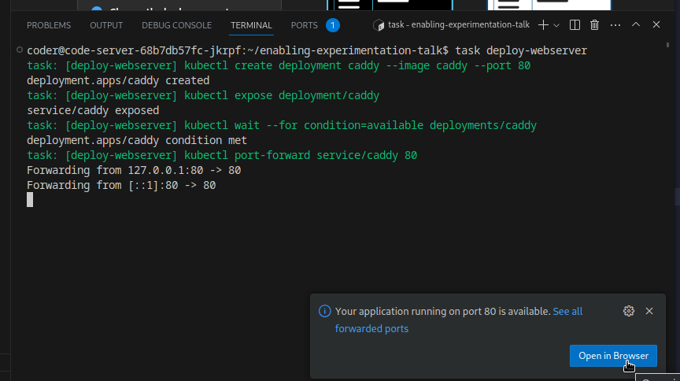

    Don't worry if you've missed it. You can find all your forwarded ports under the `ports` tab.

    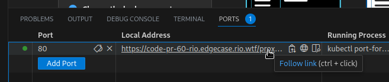

1. You should see Caddy's default page. This is the code-server proxying your request to the new webserver.
   Note the URL ending in `/proxy/80`.

    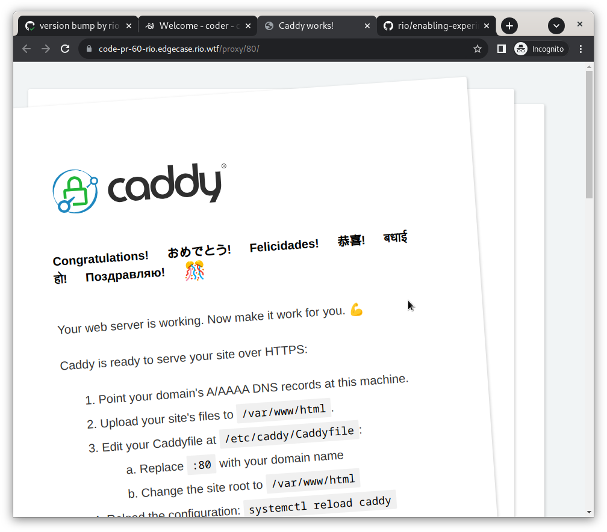

1. Kill the port-forward and automatically cleanup the caddy deployment by running `Ctrl + C` in the terminal.

# Part 5: Infrastucture

Quickly deploying some services to play with is nice. But what if you want to play with something
more on the infrastructure side of things like a service mesh. This requires cluster admin access
and luckily we have that since we're running our own cluster.

## Deploying linkerd

1. Lets see how our cuttlefish deals with a service mesh. Install linkerd by running the following
   task and wait for it to complete. Ignore any port-forward popups that might appear.
    
    ```bash
    task linkerd-install
    ```
    
    <details>
      <summary>Click here to see the output</summary>
    
    ```bash
    Rendering Linkerd CRDs...
    Next, run `linkerd install | kubectl apply -f -` to install the control plane.
    
    customresourcedefinition.apiextensions.k8s.io/authorizationpolicies.policy.linkerd.io created
    customresourcedefinition.apiextensions.k8s.io/httproutes.policy.linkerd.io created
    customresourcedefinition.apiextensions.k8s.io/meshtlsauthentications.policy.linkerd.io created
    customresourcedefinition.apiextensions.k8s.io/networkauthentications.policy.linkerd.io created
    customresourcedefinition.apiextensions.k8s.io/serverauthorizations.policy.linkerd.io created
    customresourcedefinition.apiextensions.k8s.io/servers.policy.linkerd.io created
    customresourcedefinition.apiextensions.k8s.io/serviceprofiles.linkerd.io created
    customresourcedefinition.apiextensions.k8s.io/httproutes.gateway.networking.k8s.io created
    task: [linkerd-install] linkerd install --set proxyInit.runAsRoot=true | kubectl apply -f -
    namespace/linkerd created
    clusterrole.rbac.authorization.k8s.io/linkerd-linkerd-identity created
    clusterrolebinding.rbac.authorization.k8s.io/linkerd-linkerd-identity created
    serviceaccount/linkerd-identity created
    clusterrole.rbac.authorization.k8s.io/linkerd-linkerd-destination created
    clusterrolebinding.rbac.authorization.k8s.io/linkerd-linkerd-destination created
    serviceaccount/linkerd-destination created
    secret/linkerd-sp-validator-k8s-tls created
    validatingwebhookconfiguration.admissionregistration.k8s.io/linkerd-sp-validator-webhook-config created
    secret/linkerd-policy-validator-k8s-tls created
    validatingwebhookconfiguration.admissionregistration.k8s.io/linkerd-policy-validator-webhook-config created
    clusterrole.rbac.authorization.k8s.io/linkerd-policy created
    clusterrolebinding.rbac.authorization.k8s.io/linkerd-destination-policy created
    role.rbac.authorization.k8s.io/remote-discovery created
    rolebinding.rbac.authorization.k8s.io/linkerd-destination-remote-discovery created
    role.rbac.authorization.k8s.io/linkerd-heartbeat created
    rolebinding.rbac.authorization.k8s.io/linkerd-heartbeat created
    clusterrole.rbac.authorization.k8s.io/linkerd-heartbeat created
    clusterrolebinding.rbac.authorization.k8s.io/linkerd-heartbeat created
    serviceaccount/linkerd-heartbeat created
    clusterrole.rbac.authorization.k8s.io/linkerd-linkerd-proxy-injector created
    clusterrolebinding.rbac.authorization.k8s.io/linkerd-linkerd-proxy-injector created
    serviceaccount/linkerd-proxy-injector created
    secret/linkerd-proxy-injector-k8s-tls created
    mutatingwebhookconfiguration.admissionregistration.k8s.io/linkerd-proxy-injector-webhook-config created
    configmap/linkerd-config created
    role.rbac.authorization.k8s.io/ext-namespace-metadata-linkerd-config created
    secret/linkerd-identity-issuer created
    configmap/linkerd-identity-trust-roots created
    service/linkerd-identity created
    service/linkerd-identity-headless created
    deployment.apps/linkerd-identity created
    service/linkerd-dst created
    service/linkerd-dst-headless created
    service/linkerd-sp-validator created
    service/linkerd-policy created
    service/linkerd-policy-validator created
    deployment.apps/linkerd-destination created
    cronjob.batch/linkerd-heartbeat created
    deployment.apps/linkerd-proxy-injector created
    service/linkerd-proxy-injector created
    secret/linkerd-config-overrides created
    task: [linkerd-install] linkerd viz install | kubectl apply -f -
    Waiting for control plane to become available
    Waiting for control plane to become available
    Waiting for control plane to become available
    Waiting for control plane to become available
    Waiting for control plane to become available
    Waiting for control plane to become available
    Waiting for control plane to become available
    Waiting for control plane to become available
    Waiting for control plane to become available
    namespace/linkerd-viz created
    clusterrole.rbac.authorization.k8s.io/linkerd-linkerd-viz-metrics-api created
    clusterrolebinding.rbac.authorization.k8s.io/linkerd-linkerd-viz-metrics-api created
    serviceaccount/metrics-api created
    clusterrole.rbac.authorization.k8s.io/linkerd-linkerd-viz-prometheus created
    clusterrolebinding.rbac.authorization.k8s.io/linkerd-linkerd-viz-prometheus created
    serviceaccount/prometheus created
    clusterrole.rbac.authorization.k8s.io/linkerd-linkerd-viz-tap created
    clusterrole.rbac.authorization.k8s.io/linkerd-linkerd-viz-tap-admin created
    clusterrolebinding.rbac.authorization.k8s.io/linkerd-linkerd-viz-tap created
    clusterrolebinding.rbac.authorization.k8s.io/linkerd-linkerd-viz-tap-auth-delegator created
    serviceaccount/tap created
    rolebinding.rbac.authorization.k8s.io/linkerd-linkerd-viz-tap-auth-reader created
    secret/tap-k8s-tls created
    apiservice.apiregistration.k8s.io/v1alpha1.tap.linkerd.io created
    role.rbac.authorization.k8s.io/web created
    rolebinding.rbac.authorization.k8s.io/web created
    clusterrole.rbac.authorization.k8s.io/linkerd-linkerd-viz-web-check created
    clusterrolebinding.rbac.authorization.k8s.io/linkerd-linkerd-viz-web-check created
    clusterrolebinding.rbac.authorization.k8s.io/linkerd-linkerd-viz-web-admin created
    clusterrole.rbac.authorization.k8s.io/linkerd-linkerd-viz-web-api created
    clusterrolebinding.rbac.authorization.k8s.io/linkerd-linkerd-viz-web-api created
    serviceaccount/web created
    service/metrics-api created
    deployment.apps/metrics-api created
    server.policy.linkerd.io/metrics-api created
    authorizationpolicy.policy.linkerd.io/metrics-api created
    meshtlsauthentication.policy.linkerd.io/metrics-api-web created
    networkauthentication.policy.linkerd.io/kubelet created
    configmap/prometheus-config created
    service/prometheus created
    deployment.apps/prometheus created
    server.policy.linkerd.io/prometheus-admin created
    authorizationpolicy.policy.linkerd.io/prometheus-admin created
    service/tap created
    deployment.apps/tap created
    server.policy.linkerd.io/tap-api created
    authorizationpolicy.policy.linkerd.io/tap created
    clusterrole.rbac.authorization.k8s.io/linkerd-tap-injector created
    clusterrolebinding.rbac.authorization.k8s.io/linkerd-tap-injector created
    serviceaccount/tap-injector created
    secret/tap-injector-k8s-tls created
    mutatingwebhookconfiguration.admissionregistration.k8s.io/linkerd-tap-injector-webhook-config created
    service/tap-injector created
    deployment.apps/tap-injector created
    server.policy.linkerd.io/tap-injector-webhook created
    authorizationpolicy.policy.linkerd.io/tap-injector created
    networkauthentication.policy.linkerd.io/kube-api-server created
    service/web created
    deployment.apps/web created
    serviceprofile.linkerd.io/metrics-api.linkerd-viz.svc.cluster.local created
    serviceprofile.linkerd.io/prometheus.linkerd-viz.svc.cluster.local created
    task: [linkerd-install] linkerd check
    kubernetes-api
    --------------
    √ can initialize the client
    √ can query the Kubernetes API
    
    kubernetes-version
    ------------------
    √ is running the minimum Kubernetes API version
    
    linkerd-existence
    -----------------
    √ 'linkerd-config' config map exists
    √ heartbeat ServiceAccount exist
    √ control plane replica sets are ready
    √ no unschedulable pods
    √ control plane pods are ready
    √ cluster networks contains all pods
    √ cluster networks contains all services
    
    linkerd-config
    --------------
    √ control plane Namespace exists
    √ control plane ClusterRoles exist
    √ control plane ClusterRoleBindings exist
    √ control plane ServiceAccounts exist
    √ control plane CustomResourceDefinitions exist
    √ control plane MutatingWebhookConfigurations exist
    √ control plane ValidatingWebhookConfigurations exist
    √ proxy-init container runs as root user if docker container runtime is used
    
    linkerd-identity
    ----------------
    √ certificate config is valid
    √ trust anchors are using supported crypto algorithm
    √ trust anchors are within their validity period
    √ trust anchors are valid for at least 60 days
    √ issuer cert is using supported crypto algorithm
    √ issuer cert is within its validity period
    √ issuer cert is valid for at least 60 days
    √ issuer cert is issued by the trust anchor
    
    linkerd-webhooks-and-apisvc-tls
    -------------------------------
    √ proxy-injector webhook has valid cert
    √ proxy-injector cert is valid for at least 60 days
    √ sp-validator webhook has valid cert
    √ sp-validator cert is valid for at least 60 days
    √ policy-validator webhook has valid cert
    √ policy-validator cert is valid for at least 60 days
    
    linkerd-version
    ---------------
    √ can determine the latest version
    √ cli is up-to-date
    
    control-plane-version
    ---------------------
    √ can retrieve the control plane version
    √ control plane is up-to-date
    √ control plane and cli versions match
    
    linkerd-control-plane-proxy
    ---------------------------
    √ control plane proxies are healthy
    √ control plane proxies are up-to-date
    √ control plane proxies and cli versions match
    
    linkerd-viz
    -----------
    √ linkerd-viz Namespace exists
    √ can initialize the client
    √ linkerd-viz ClusterRoles exist
    √ linkerd-viz ClusterRoleBindings exist
    √ tap API server has valid cert
    √ tap API server cert is valid for at least 60 days
    √ tap API service is running
    √ linkerd-viz pods are injected
    √ viz extension pods are running
    √ viz extension proxies are healthy
    √ viz extension proxies are up-to-date
    √ viz extension proxies and cli versions match
    √ prometheus is installed and configured correctly
    √ viz extension self-check
    
    Status check results are √
    ```
    </details>

1. Inject the linkerd proxy into our podinfo deployment by running another task. This will also restart the deployment.
    
    ```bash
    task linkerd-inject
    ```
    
    <details>
      <summary>Click here to see the output</summary>
    
    ```bash
    task: [linkerd-inject] kubectl get deployment podinfo -n podinfo -o yaml | linkerd inject - | kubectl apply -f -
    
    deployment "podinfo" injected
    
    deployment.apps/podinfo configured
    task: [linkerd-inject] kubectl rollout status deployment/podinfo -n podinfo
    Waiting for deployment "podinfo" rollout to finish: 0 out of 2 new replicas have been updated...
    Waiting for deployment "podinfo" rollout to finish: 1 out of 2 new replicas have been updated...
    Waiting for deployment "podinfo" rollout to finish: 1 out of 2 new replicas have been updated...
    Waiting for deployment "podinfo" rollout to finish: 1 out of 2 new replicas have been updated...
    Waiting for deployment "podinfo" rollout to finish: 1 out of 2 new replicas have been updated...
    Waiting for deployment "podinfo" rollout to finish: 1 old replicas are pending termination...
    Waiting for deployment "podinfo" rollout to finish: 1 old replicas are pending termination...
    Waiting for deployment "podinfo" rollout to finish: 1 old replicas are pending termination...
    deployment "podinfo" successfully rolled out
    ```
    
    </details>

1. (Optional) You can inject your code-server pod as well so it will show up when we run all the
   other linkerd commands in the next section. Just be sure to reload your browser a couple of times
   until the pod is back up. Don't forget to restart the curl loop that polls the podinfo service.

    ```bash
    kubectl get deploy/code-server -o yaml | linkerd inject - | kubectl apply -f -
    ```

## Exploring linkerd

Your cuttlefish should still be clapping away even with the service mesh in place. Make sure you
have the cuttlefish page open in a tab somewhere as it will keep polling your podinfo backend.

1. Lets checkout all of the edges between systems that linkerd knows about.
    
    ```bash
    task linkerd-edges
    ```
    
    You should be able to see something similar to the following. Note the bottom line which shows
    the connection between prometheus and podinfo is secured using mTLS.
    
    ```bash
    task: [linkerd-edges] linkerd viz edges deployments --all-namespaces
    SRC           DST                      SRC_NS        DST_NS        SECURED       
    code-server   podinfo                  code-server   podinfo       √  
    prometheus    code-server              linkerd-viz   code-server   √  
    metrics-api   prometheus               linkerd-viz   linkerd-viz   √  
    prometheus    metrics-api              linkerd-viz   linkerd-viz   √  
    prometheus    tap                      linkerd-viz   linkerd-viz   √  
    prometheus    tap-injector             linkerd-viz   linkerd-viz   √  
    prometheus    web                      linkerd-viz   linkerd-viz   √  
    prometheus    linkerd-destination      linkerd-viz   linkerd       √  
    prometheus    linkerd-identity         linkerd-viz   linkerd       √  
    prometheus    linkerd-proxy-injector   linkerd-viz   linkerd       √  
    prometheus    podinfo                  linkerd-viz   podinfo       √  
    ```

1. Lets see the http paths that are being called by running `task linkerd-top`.

    ```bash
    task linkerd-top
    ````
    
    Initially you should see something like this. This is mainly the initial page load (the `/` path)
    and the subsequent polls that the frontend does (the `/api/info` paths). Note that both pods are
    responding to requests.
    
    ```bash
    Source                       Destination               Method      Path        Count    Best   Worst    Last  Success Rate
    code-server-8f88b9964-2ltzd  podinfo-6cb6fdb9c8-rwcts  GET         /              13   856µs     1ms   859µs       100.00%
    10.42.0.1                    podinfo-6cb6fdb9c8-69tvm  GET         /api/info       7     1ms     2ms     1ms       100.00%
    192.168.1.3                  podinfo-6cb6fdb9c8-rwcts  GET         /api/info       6     1ms     2ms     1ms       100.00%
    code-server-8f88b9964-2ltzd  podinfo-6cb6fdb9c8-69tvm  GET         /               5     1ms     2ms     2ms       100.00%
    ```

1. Keep linkerd top running and open a new terminal by clicking the `+` button in the terminal tab.

    

1.  In this terminal run a variation of the curl command again you used previously to call the podinfo service. 
    This time add `/status/500` to the curl command to let it fail and see that path show up in the linkerd output.
    
    ```bash
    curl podinfo.podinfo:9898/status/500
    ```
    
    You'll see the path show up in the linkerd output with a success rate of 0.00%.
    
    ```bash
    Source                        Destination               Method      Path          Count    Best   Worst    Last  Success Rate
    ...
    code-server-68b7db57fc-jkrpf  podinfo-5ff6c6b6c9-n628j  GET         /status/500       1     2ms     2ms     2ms         0.00%
    ```

# Part 6 (optional): Clusters in Clusters in Clusters

1. Open a terminal and create a vcluster by running the following command.
    
    ```bash
    vcluster create test-cluster
    ```
    
    It should start port forwarding to the new kubernetes api that just got created.
    
    ```bash
    info   Downloading [command helm]
    info   Create vcluster test-cluster...
    info   execute command: helm upgrade test-cluster /tmp/vcluster-0.15.7.tgz-2160875115 --kubeconfig /tmp/997274681 --namespace code-server --install --repository-config='' --values /tmp/3780948728
    done √ Successfully created virtual cluster test-cluster in namespace code-server
    info   Waiting for vcluster to come up...
    warn   vcluster is waiting, because vcluster pod test-cluster-0 has status: PodInitializing
    warn   vcluster is waiting, because vcluster pod test-cluster-0 has status: PodInitializing
    warn   vcluster is waiting, because vcluster pod test-cluster-0 has status: PodInitializing
    warn   vcluster is waiting, because vcluster pod test-cluster-0 has status: PodInitializing
    done √ Switched active kube context to vcluster_test-cluster_code-server_
    warn   Since you are using port-forwarding to connect, you will need to leave this terminal open
    - Use CTRL+C to return to your previous kube context
    - Use `kubectl get namespaces` in another terminal to access the vcluster
    Forwarding from 127.0.0.1:10071 -> 8443
    Forwarding from [::1]:10071 -> 8443
    ```

1. Once it starts forwarding a connection open a new terminal and run kubectl again.
    
    ```bash
    kubectl get pods -A
    ```
    
    This should list all the pods in the vcluster. But because vcluster is so minimal you'll only see
    the coredns pod.
    
    ```bash
    NAMESPACE     NAME                       READY   STATUS    RESTARTS   AGE
    kube-system   coredns-864d4658cb-9jxsq   1/1     Running   0          106s
    ```

1. Terminate the `vcluster create` command and run `kubectl get pods -A` one last time.
    
    ```bash
    kubectl get pods -A
    ```
    
    You'll see the new coredns pod and a new vcluster pod in the code-server namespace.
    
    ```bash
    NAMESPACE     NAME                                                    READY   STATUS    RESTARTS   AGE
    kube-system   coredns-864d4658cb-nq9nb                                1/1     Running   0          82m
    code-server   code-server-68b7db57fc-jkrpf                            1/1     Running   0          81m
    ...
    podinfo       podinfo-5ff6c6b6c9-jdjmk                                2/2     Running   0          20m
    podinfo       podinfo-5ff6c6b6c9-n628j                                2/2     Running   0          20m
    code-server   test-cluster-0                                          2/2     Running   0          4m16s
    code-server   coredns-864d4658cb-9jxsq-x-kube-system-x-test-cluster   1/1     Running   0          3m8s
    ```

1. Delete the vcluster by running `vcluster delete test-cluster`
    
    ```bash
    vcluster delete test-cluster
    ```

    You should see the following output.

    ```bash
    info   Delete vcluster test-cluster...
    done √ Successfully deleted virtual cluster test-cluster in namespace code-server
    done √ Successfully deleted virtual cluster pvc data-test-cluster-0 in namespace code-server
    ```

# Final Part: Cleanup

1. Close your pull request and watch it all disappear.

    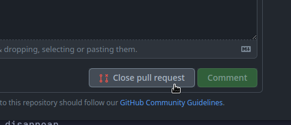
